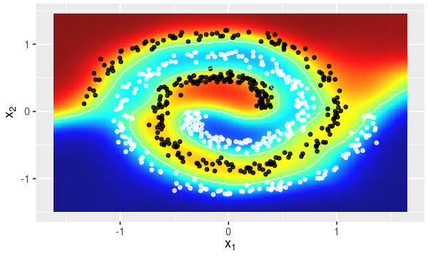
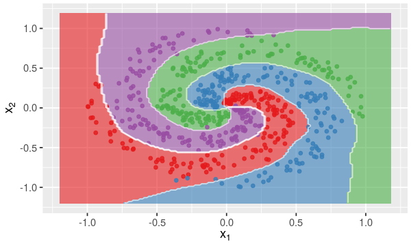

================

> Nonlinear Regression and Classification with Regularized and Pruned Extreme Learning Machines

How To Install?
---------------

``` r
library('devtools')
install_github(repo = "davidnexer/elmnet")
```

Regularization Methods
----------------------

-   Lasso (*in development*)
-   Ridge Regression
-   Elastic-net (*in development*)

Pruning Methods
---------------

-   Fast Pruned ELM (P-ELM) \[1\] (*in development*)
-   Optimally Pruned ELM (OP-ELM) \[2\] (*in development*)
-   Double-Regularized ELM (TROP-ELM) \[3\] (*in development*)

Toy Examples
------------

Classification decision boudary for nonlinear problems.

``` r
# Load packages
library('elmnet')
library('caTools')
```

### Two-class example

``` r
# Load toy data
data('spirals', package = 'elmnet')
x <- spirals$x
y <- spirals$y

# Split data
tr.idx <- caTools::sample.split(y, SplitRatio = 0.7)
x.tr <- x[tr.idx,]
x.te <- x[!tr.idx,]
y.tr <- y[tr.idx]
y.te <- y[!tr.idx]

# Fit ELM model
elm.model <- elmnet(x.tr, y.tr, nodes = 300, standardize = TRUE)

# Draw classification decision boudary
elmDecisionBound(elm.model, x.te, y.te, resamp = 150)
```



### Multi-class example

``` r
# Load toy data
data('multi_spirals', package = 'elmnet')
x <- multi_spirals$x
y <- multi_spirals$y

# Split data
tr.idx <- caTools::sample.split(y, SplitRatio = 0.7)
x.tr <- x[tr.idx,]
x.te <- x[!tr.idx,]
y.tr <- y[tr.idx]
y.te <- y[!tr.idx]

# Fit ELM model
elm.model <- elmnet(x.tr, y.tr, nodes = 300, standardize = TRUE)

# Draw classification decision boudary
elmDecisionBound(elm.model, x.te, y.te, resamp = 150)
```



------------------------------------------------------------------------

### References

\[1\] Rong, Hai-Jun, Yew-Soon Ong, Ah-Hwee Tan, and Zexuan Zhu. "A fast pruned-extreme learning machine for classification problem." Neurocomputing 72, no. 1 (2008): 359-366.

\[2\] Miche, Yoan, Antti Sorjamaa, Patrick Bas, Olli Simula, Christian Jutten, and Amaury Lendasse. "OP-ELM: optimally pruned extreme learning machine." Neural Networks, IEEE Transactions on 21, no. 1 (2010): 158-162.

\[3\] Miche, Yoan, Mark Van Heeswijk, Patrick Bas, Olli Simula, and Amaury Lendasse. "TROP-ELM: a double-regularized ELM using LARS and Tikhonov regularization." Neurocomputing 74, no. 16 (2011): 2413-2421.
